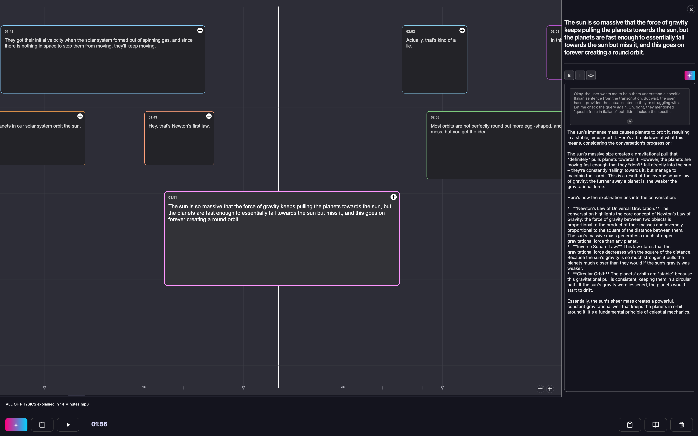

# 🚢 Cruise - AI-Powered Audio Transcription Application

## Overview

Cruise is a modern, feature-rich audio transcription application built with PySide6 and powered by OpenAI's Whisper AI with local Ollama integration for intelligent analysis. It provides an intuitive glassmorphism interface for transcribing audio files with high accuracy, AI-powered explanations, and supports multiple languages and file formats.

**🤖 Powered by Local AI**: Cruise integrates seamlessly with Ollama to provide contextual explanations, interactive learning through Studio Mode, and intelligent analysis of your transcriptions - all running locally on your machine.



## ✨ Key Features

### 🎯 Core Functionality
- **AI-Powered Transcription**: Uses OpenAI Whisper models for accurate speech-to-text conversion
- **Multi-Format Support**: Supports MP3, WAV, M4A, FLAC, AAC, OGG, WMA, MP4, AVI, MOV files
- **Real-time Audio Playback**: Built-in audio player with waveform visualization
- **Project Management**: Save, load, and organize transcription projects
- **Note-Taking System**: Add timestamped notes and annotations

### 🌍 Internationalization
- **Multi-Language Support**: Available in 9 languages:
  - English (en)
  - Italian (it)
  - Spanish (es)
  - French (fr)
  - German (de)
  - Portuguese (pt)
  - Chinese (zh)
  - Japanese (ja)
  - Catalan (ca)

### 🎨 Modern Interface
- **Glassmorphism Design**: Beautiful, modern UI with glass-like effects
- **Dark/Light Theme**: Automatic system theme detection
- **Responsive Layout**: Adaptive interface that works on different screen sizes
- **Audio Waveform Visualization**: Visual representation of audio files

### 🔧 Advanced Features
- **Multiple Whisper Models**: Choose from tiny, base, small, medium, large models
- **Ollama AI Integration**: Local AI models for intelligent transcription analysis and explanations
- **Studio Mode**: Interactive AI-powered learning environment with real-time explanations
- **Database Storage**: SQLite database for project and transcription management
- **Export Options**: Copy transcriptions to clipboard
- **Keyboard Shortcuts**: Spacebar for play/pause, and more

## Installation

### Prerequisites
- Python 3.8 or higher
- macOS, Windows, or Linux
- At least 4GB RAM (8GB recommended for larger models)
- Internet connection for initial model downloads

### Quick Start

1. **Clone the repository**:
   ```bash
   git clone [<repository-url>](https://github.com/askscience/cruise.git)
   cd transcriber_rewrite
   ```

2. **Run the application**:
   ```bash
   python launcher.py
   ```
   
   The launcher will automatically:
   - Create a virtual environment
   - Install required dependencies
   - Launch the welcome screen for first-time setup

### Manual Installation

If you prefer manual setup:

1. **Create virtual environment**:
   ```bash
   python -m venv transcriber_env
   source transcriber_env/bin/activate  # On Windows: transcriber_env\Scripts\activate
   ```

2. **Install dependencies**:
   ```bash
   pip install -r requirements.txt
   ```

3. **Run the application**:
   ```bash
   python launcher.py
   ```

## Usage

### First Launch
1. Run `python launcher.py`
2. Complete the welcome screen setup:
   - Select your preferred language
   - Choose Whisper model size (tiny for speed, large for accuracy)
   - Configure optional Ollama integration
   - Complete system requirements check

### Basic Workflow
1. **Load Audio File**: Click "Browse" to select an audio file
2. **Start Transcription**: Click "Transcribe" to begin AI processing
3. **Review Results**: View the transcription in the waveform visualization
4. **AI Analysis**: Click on any transcribed segment to get AI explanations (requires Ollama)
5. **Studio Mode**: Toggle studio mode for interactive learning with conversational AI
6. **Add Notes**: Use the sidebar to add timestamped notes and annotations
7. **Save Project**: Save your work for later editing
8. **Export**: Copy transcription to clipboard or export to file

### Audio Playback
- **Play/Pause**: Click the play button or press Spacebar
- **Seek**: Click on the waveform to jump to specific positions
- **Visual Feedback**: Waveform shows playback progress

### Studio Mode

Studio Mode transforms Cruise into an interactive learning environment powered by AI:

#### Features
- **Conversational AI**: Chat with AI about your transcriptions in real-time
- **Contextual Understanding**: AI maintains context of the entire transcription
- **Educational Focus**: AI acts as a knowledgeable teacher, providing explanations and insights
- **Thinking Process**: Watch AI "think" through problems with visible reasoning
- **Multi-turn Conversations**: Build on previous questions and answers
- **Markdown Support**: Rich text formatting in AI responses

#### How to Use Studio Mode
1. **Transcribe Audio**: Complete a transcription first
2. **Toggle Studio Mode**: Click the studio mode button in the interface
3. **Select Text**: Click on any transcribed segment to analyze
4. **Ask Questions**: Type questions about the content in the chat interface
5. **Interactive Learning**: Engage in back-and-forth conversations with the AI

#### Studio Mode vs Regular Mode
- **Regular Mode**: Quick AI explanations of selected text segments
- **Studio Mode**: Full conversational interface with chat history and educational focus

### Project Management
- **New Project**: Start fresh transcription projects
- **Save Project**: Preserve your work with notes and timestamps
- **Load Project**: Resume previous transcription sessions
- **Project History**: Access recently worked projects

## Configuration

### Models
- **Whisper Models**: Choose based on your needs:
  - `tiny`: Fastest, least accurate (~39 MB)
  - `base`: Good balance (~74 MB)
  - `small`: Better accuracy (~244 MB)
  - `medium`: High accuracy (~769 MB)
  - `large`: Best accuracy (~1550 MB)

### Ollama Integration

Cruise integrates with [Ollama](https://ollama.com/) to provide intelligent AI analysis of your transcriptions:

#### Supported Models
- **Gemma 3** (1B, 4B): Fast Google models for quick analysis
- **Llama 3.2** (1B, 3B): Meta's efficient models
- **Llama 3.1** (8B): Advanced model for detailed explanations
- **Mistral** (7B): Balanced performance model
- **Qwen 3** (0.6B, 1.7B): Ultra-fast Alibaba models
- **Phi4-mini** (3.8B): Microsoft's compact model

#### AI Features
1. **Smart Explanations**: Click any transcribed segment to get contextual AI analysis
2. **Studio Mode**: Interactive learning environment with conversational AI
3. **Multi-language Support**: AI responds in your selected interface language
4. **Streaming Responses**: Real-time AI responses with thinking process visualization

### Settings
Configuration is stored in `transcriber_config.json`:
```json
{
  "whisper_model": "medium",
  "ollama_model": "qwen3:latest",
  "setup_completed": true,
  "language": "en"
}
```

## Architecture

### Project Structure
```
app/
├── main/           # Core application logic
├── components/     # Reusable UI components
├── services/       # Business logic services
├── setup/          # Initial setup and configuration
└── utils/          # Utility functions and helpers

translations/       # Internationalization files
icons/             # Application icons
styles.qss         # Centralized styling
launcher.py        # Application entry point
```

### Key Components
- **TranscriptionService**: Handles Whisper AI integration
- **DatabaseManager**: Manages SQLite database operations
- **AudioTranscriberGUI**: Main application window
- **SidebarManager**: Project and notes management
- **TranslationManager**: Multi-language support

## ⌨️ Keyboard Shortcuts

### Audio Controls
- **Spacebar**: Play/Pause audio
- **Left/Right Arrow**: Seek backward/forward

### File Operations
- **Ctrl+O** (Cmd+O on Mac): Open file browser
- **Ctrl+T** (Cmd+T on Mac): Start transcription
- **Ctrl+S** (Cmd+S on Mac): Save project
- **Ctrl+N** (Cmd+N on Mac): New project
- **Ctrl+C** (Cmd+C on Mac): Copy transcription to clipboard

### AI & Studio Mode
- **Click on text segment**: Get AI explanation (requires Ollama)
- **Studio Mode Toggle**: Switch between regular and conversational AI mode
- **Enter**: Send message in studio mode chat
- **Esc**: Stop AI response generation

## Troubleshooting

### Common Issues

1. **Audio playback issues**:
   - Ensure pygame is properly installed
   - Check audio file format compatibility
   - Verify system audio drivers

2. **Transcription errors**:
   - Ensure sufficient RAM for selected model
   - Check internet connection for model downloads
   - Verify audio file is not corrupted

3. **UI rendering issues**:
   - Update graphics drivers
   - Try different theme settings
   - Check display scaling settings

### Ollama Integration Issues

1. **AI explanations not working**
   - Ensure Ollama is installed: `curl -fsSL https://ollama.ai/install.sh | sh`
   - Check if Ollama service is running: `ollama list`
   - Verify your selected model is downloaded

2. **Model not found**
   - Download the model: `ollama pull qwen3:latest`
   - Check available models: `ollama list`
   - Restart Cruise after downloading new models

3. **Studio Mode not responding**
   - Check Ollama service status
   - Try switching to a smaller, faster model
   - Restart Ollama service: `ollama serve`

4. **Slow AI responses**
   - Use smaller models (1B-3B parameters) for faster responses
   - Ensure sufficient RAM (8GB+ recommended for larger models)
   - Close other applications using GPU/CPU resources

### Performance Tips

- Use smaller Whisper models for faster processing
- Close other applications to free up RAM
- Use SSD storage for better file I/O performance
- Ensure good audio quality for better transcription accuracy

## Development

### Contributing
1. Fork the repository
2. Create a feature branch
3. Make your changes
4. Add tests if applicable
5. Submit a pull request

### Code Style
- Follow PEP 8 guidelines
- Use type hints where appropriate
- Document functions and classes
- Maintain modular architecture

## License

This project is licensed under the GNU General Public License v3.0 - see the [LICENSE](LICENSE) file for details.

## Acknowledgments

- OpenAI for the Whisper speech recognition model
- Qt/PySide6 for the cross-platform GUI framework
- The open-source community for various dependencies

## Support

For issues, feature requests, or questions:
1. Check the troubleshooting section
2. Search existing issues
3. Create a new issue with detailed information

---

**Cruise** - Transcribe with confidence. 🚀
